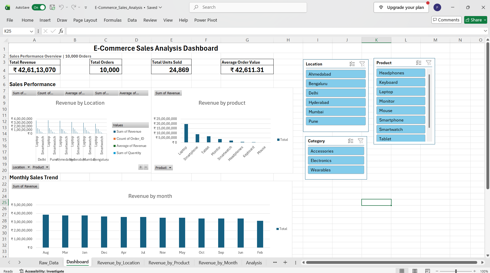

# E-Commerce Sales Analysis using Excel

## About the Project

I created this project to practice data analysis using Microsoft Excel.

The dataset contains 10,000 e-commerce orders. I analyzed the sales data to understand revenue, orders, products, locations, discounts, and monthly sales trends.

I also created an interactive dashboard where the data can be filtered using slicers.

## What I Worked On

- Cleaned and checked the dataset
- Used Excel formulas for analysis
- Created PivotTables and PivotCharts
- Used XLOOKUP, VLOOKUP and INDEX-MATCH
- Used IF, IFS, SUMIFS, COUNTIFS and AVERAGEIFS
- Worked with text and date functions
- Added conditional formatting
- Created an interactive dashboard using slicers
- Checked the revenue calculations for the dataset

## Dashboard

The dashboard shows:

- Total Revenue
- Total Orders
- Total Units Sold
- Average Order Value
- Revenue by Location
- Revenue by Product
- Monthly Revenue

The dashboard can be filtered using Location, Product and Category slicers.

## Some Results

- Total Revenue: ₹426,113,070
- Total Orders: 10,000
- Total Units Sold: 24,869
- Average Order Value: ₹42,611.31
- Delhi had the highest revenue among the locations.
- Laptop was the highest revenue-generating product.

## Files

- `E-Commerce_Sales_Analysis.xlsx` – Excel workbook with the analysis and dashboard
- `Raw_Data.xlsx` – Original dataset

## Tools Used

**Microsoft Excel**

## Author

Yash Desai
